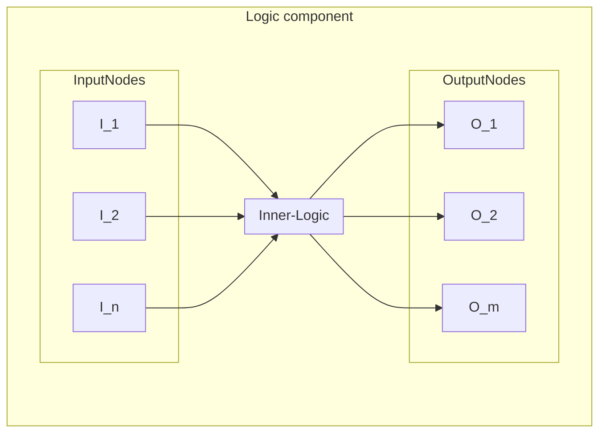
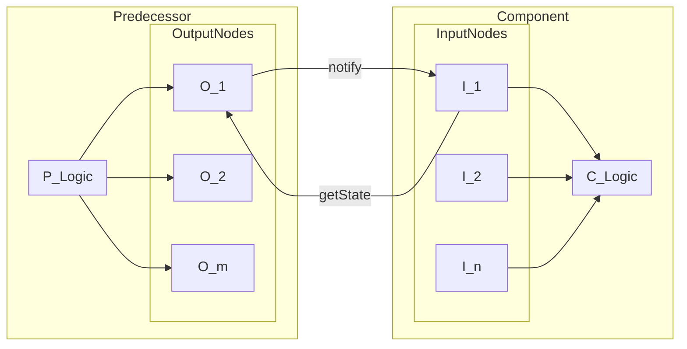

# Base
This folder contains all mutual code for the [logic components](../README.md).

## Core idea
Each [logic component](../README.md) must extend the `Logic` class. This class can be used to link multiple other logic components to create complexer components. Internally each component contains `Node` objects. Any node can connect with any other node. When one node updates it propagates this update to all the nodes that are connected to it.

### Structure

The `Logic` class keeps a map of all it's nodes. This map has the type `std::unordered_map<NodeType, std::shared_ptr<Node>>`. `NodeType` is an enum containing all the names for the nodes. A node can be retrieved from a compnent using this name.
### Connections
In order to create a cpu we will need to connect multiple logic components. This can be done by connecting multiple nodes of different components. 

#### Connect
The `Node::connect(std::shared_ptr<Node> node)` will connect 2 given `Node`'s. 

Let's say we connect input 1 with output 1. The following happens
- I_1 stores O_1 as node to fetch state from.
- O_1 adds I_1 to it's set of nodes to notify when it updates.

If the predecessor's O_1 updates state, our component's I_1 will be notified, will update itself, and will tell our component that it updated, next it will notify all the nodes that are subscribed to it.
This way the update of a node will propagate through the circuitry until every component has the correct state.

Note that a node can only have one predecessor, but may have multiple subscribed nodes.

#### Disconnect
Analogue to the connect function the `Logic::disConnect(InputBits in)` will disconnect a given input bit from the output bit it listens to.

### NodeType
The `NodeType` enum is located in `src/logic/base/Node.h`. When you create a new logic component you have to add all the nodes to this enum. The name of your newnode will follow the following structure

<IN|OUT>\_<COMPONENT_NAME_ALL_CAPS>\_<BIT_NAME_ALL_CAPS>

All the logic components use the `NodeType` enum to index their nodes. This implies that the type checker will not detect when you try to access a node that doesn't exist on a component. Make sure that you always request the correct node.

### Logic update()
The `update()` function in the `Logic` class is called when any of it's nodes are notified for an update. Since nodes automatically update when the predecessor updates this function is empty. However, by doing so we would only be able to pass state, but not change state. The basic operations like `or`, `and`, etc. will be implemented by overriding this update function.

