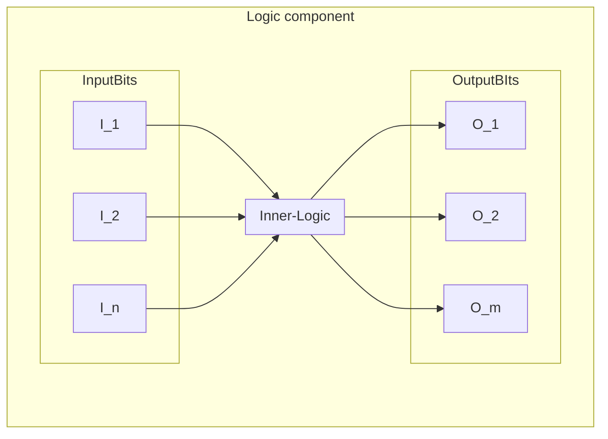
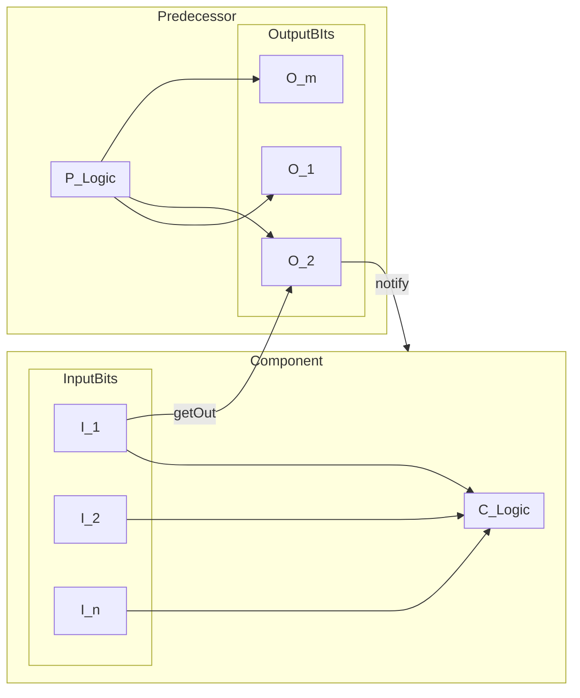

# Base
This folder contains all mutual code for the [logic components](../README.md).

## Core idea
Each [logic component](../README.md) must extend the `Logic` class. This class manages some of the basic necessities of each component
- **State management**: The logic class will keep track of all the output bits of the logic component.
- **[Connection management](#Connections)**:The logic class will keep track of all the other components that are connected to this component. This for both the in and output bits of this class.

### Structure

All the logic components consist of 3 parts:
- 1. **InputBits**: These are the input values of the component. The inner logic can make use of these to compute the OutputBits. All the InputBits of all components are listed in the enum `InputBits`. Please read [here](#InputBits) on how to use this enum.
- 2. **OutputBits**: These are the output values of the component. The inner logic will update these. All the OutputBits of all components are listed in the enum `OutputBits`. Please read [here](#OutputBits) on how to use this enum.
- 3. **Inner Logic**: The inner logic must use the InputBits to compute the Outputbits. In order to do this it will evaluate the `Logic::update()` function. See [here](#update()) how that works.
### Connections
In order to create a cpu we will need to connect multiple logic components. This is also handled by the `Logic` class.

#### Connect
The `Logic::connect(InputBits in, Logic& predecessor, OutputBits out)` will connect a given output bit from a predecessor logic component to a given input bit of this component. It will do this in 3 steps.

- Store a ptr to the predecessor and the outputbit
- Let the predecessor store a ptr to this component so it can notify when it updates.
- Update self.

Let's say we connect input 1 with output 2

Our component will now be connected with the predecessor. Should the predecessor's output 2 update, it will notify our component. He will then be able to fetch the value of the predecessor's output 2. Inputbits are thus not stored inside the component, but in the predecessor.

#### Disconnect
Analogue to the connect function the `Logic::disConnect(InputBits in)` will disconnect a given input bit from the output bit it listens to.

### In- and out bits
#### InputBits
The `InputBits` enum is located in `src/logic/base/InputBits.h`. When you create a new logic component you have to add all the input bits to this enum. The name of your new input bit will follow the following structure

IN\_<COMPONENT_NAME_ALL_CAPS>\_<BIT_NAME_ALL_CAPS>

Once all enum values are defined your new class must make available which enum values correspond to it's component. To do so, implement the [getAllInputBits()](#getAllInputBits()) function.
#### OutputBits
The `OutputBits` enum is located in `src/logic/base/OutputBits.h`. When you create a new logic component you have to add all the output bits to this enum. The name of your new input bit will follow the following structure

OUT\_<COMPONENT_NAME_ALL_CAPS>\_<BIT_NAME_ALL_CAPS>

Once all enum values are defined your new class must make available which enum values correspond to it's component. To do so, implement the [getAllOutputBits()](#getAllOutputBits()) function.

## Pure virtual functions

#### update()
The `update()` function must be implemented in each logic component. This function is used to compute the output values from the input values. If any predecessor component calls `notify()` the `update()`  function will recompute the output bits since they may be updated. Using this method the change of any output bit will propagate trough the logic network until it stabilises. 
#### getAllInputBits()
This method simply returns a set of all the input bits corresponding to this component.
To implement this function to the following.
```cpp
// MyComponent.h
class MyComponent{
	private:
		// define static set
		static std::unordered_set<InputBits> _inBits;
		// override function
		std::unordered_set<InputBits> getAllInputBits() override;
		...
}
```
```cpp
// MyComponent.cpp

// init set
std::unordered_set<InputBits> MyComponent::_inBits = {IN_VAL_1, IN_VAL_2, ...};

// implement function
std::unordered_set<InputBits> MyComponent::getAllInputBits(){
	return _inBits;
}
```
#### getAllOutputBits()
This method simply returns a set of all the output bits corresponding to this component.
To implement this function to the following.
```cpp
// MyComponent.h
class MyComponent{
	private:
		// define static set
		static std::unordered_set<OutputBits> _outBits;
		// override function
		std::unordered_set<OutputBits> getAllOutputBits() override;
		...
}
```
```cpp
// MyComponent.cpp

// init set
std::unordered_set<OutputBits> MyComponent::_outBits = {IN_VAL_1, IN_VAL_2, ...};

// implement function
std::unordered_set<OutputBits> MyComponent::getAllOutputBits(){
	return _outBits;
}
```
## Drawbacks
The pure virtual functions are needed to initialise the Logic object. Calling a virtual function in a constructor however is bad practice and may lead to crashes, undesired behaviour, etc.
To overcome this the `src/logic/base/component_factory.h` contains a `createLogicComponent` function. This is a template function that can create any logic component. Internally it will:
1. Create the object
2. Call the `initialize()` function. This will init the data structures with basic values.
3. Call `update()`

This way objects can be safely created. Keep in mind not to use the data structures in the constructor of your child class since they will be reset afterwards by the `initialize()` function.

```cpp
// create new object of class MyComponent
std::shared_ptr<MyComponent> = std::make_shared<MyComponent>();
```
