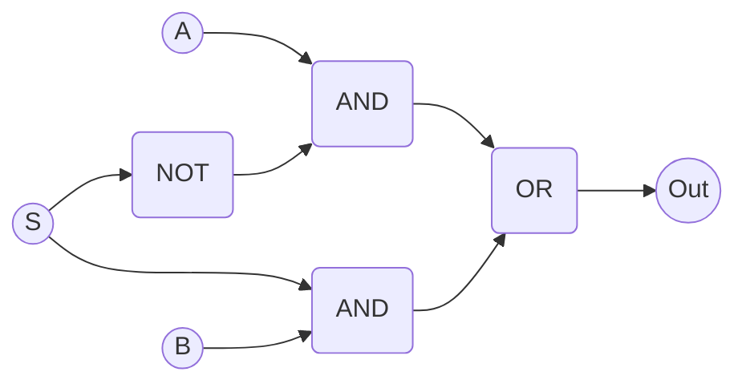

# [Gates](https://en.wikipedia.org/wiki/Logic_gate)
### Not,  And, Or, Nand,  Nor

- **Not**
> - IN_NOT
> - OUT_NOT
- **And**
> - IN_AND_A
> - IN_AND_B
> - OUT_AND
- **Or**
> - IN_OR_A
> - IN_OR_B
> - OUT_OR
- **Nand**
> - IN_NAND_A
> - IN_NAND_B
> - OUT_NAND
- **Nor**
> - IN_NOR_A
> - IN_NOR_B
> - OUT_NOR

These logic components are implemented using the cpp logic functions. A single Nand or Nor gate would be sufficient to create all the other gates. But this is somewhat faster.

### Xor
> - IN_XOR_A
> - IN_XOR_B
> - OUT_XOR

The xor gate is created using a or, nand and and gate.

### Xnor
> - IN_XNOR_A
> - IN_XNOR_B
> - OUT_XNOR

This gate is created by adding a not gate at the end of the xor gate.

#### Selector
> - IN_SELECTOR_A
> - IN_SELECTOR_B
> - IN_SELECTOR_S
> - OUT_SELECTOR

This component will select A if S is 0, and B if S is 1.

|S|A|B|out|
|-|-|-|-|
|0|0|0|0|
|0|0|1|0|
|0|1|0|1|
|0|1|1|1|
|1|0|0|0|
|1|0|1|1|
|1|1|0|0|
|1|1|1|1|